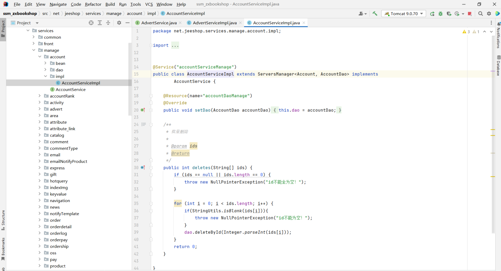
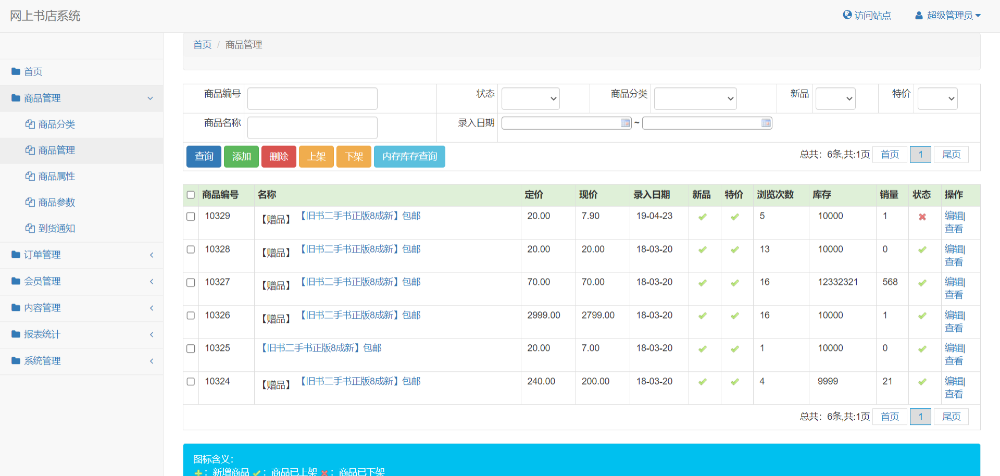
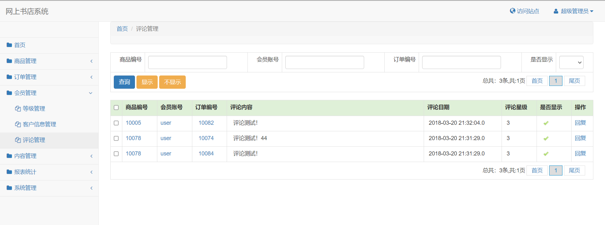
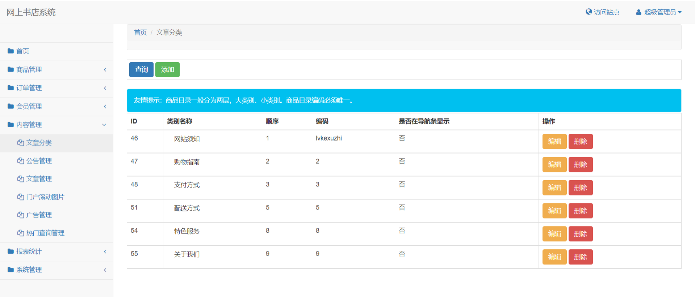
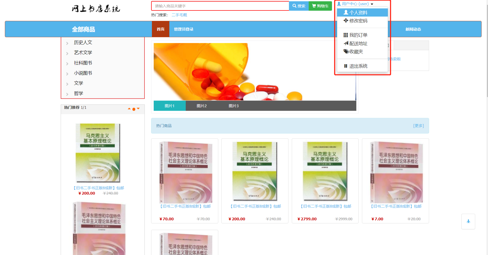
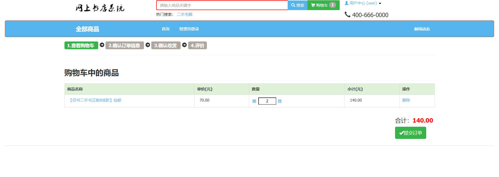
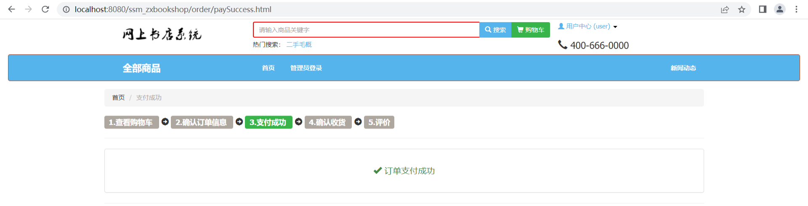

# java+jsp的图书商城管理系统

有问题，或者不会调试运行的 , 可以添加微信：xzxj0206

## 一、技术栈
java+jsp
1. 后端：Spring+SpringMVC+Mybatis
2. 前端：Freemarker+css+javascript+bootstrap+jQuery
 

## 二、本项目分为前后台，有管理员与用户两种角色；

### 1、管理员角色包含以下功能：

1、管理员登录 2、商品分类管理 3、商品管理 4、商品属性管理 5、商品参数管理 
6、订单管理 7、退款管理 8、退货管理 9、会员等级管理 10、客户信息管理 
11、评论管理 12、文章分类管理 13、公告管理 14、文章管理 15、滚动图片管理 
16、广告管理 17、热门查询管理 19、查询订单销售 20、查询商品销售 21、用户管理 
22、角色管理 23、资源管理 24、修改密码 25、区域管理 26、配送方式管理 
27、查看系统设置 28、缓存管理 29、查询到货通知等功能。

### 2、用户角色包含以下功能：

1、用户登录 2、查看首页 3、查看商品详情 4、查看购物车 5、提交订单 6、修改个人信息 
7、修改密码 8、查看我的订单 9、添加配送地址 10、查看收藏夹等功能。

## 三、管理员功能页面展示

## 四、用户功能页面展示

